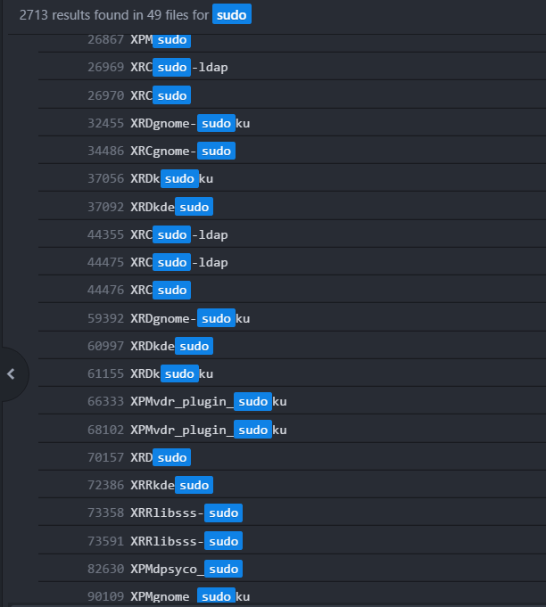
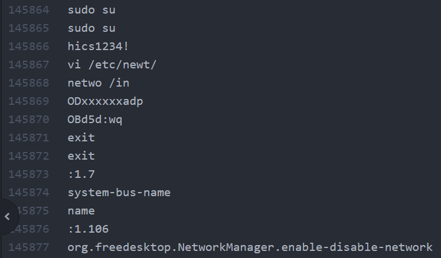

# CCE1

## 시나리오
우리는 블랙해커이다. 우리는 카페에서 노트북을 획득하였다.
이 노트북에는 암호가 걸려 있다. 이 암호를 획득하여라.

문제에서 노트북을 직접 줄 수는 없으니, 우리는 VMware 가상 이미지를 얻었다.

암호를 모르기에, 우리는 컴퓨터에 접근조차 할 수 없다.
처음에 single 모드를 이용하여 암호를 바꾸어 hcic호스트에 로그인 하였으나 별다른 소득은 없었다.
그렇다면 암호가 있을 장소는 메모리밖에 없을 것이다.

VMware 가상 이미지에는 .vmem이라는 파일이 있다.
이 파일은 일시정지된 상태를 저장한 것으로, 이 파일은 실행중인 컴퓨터의 메모리의 정보를 가지고 있다.
운이 좋다면 메모리 상에서 비밀번호를 획득할 수 있을 것이다.

여기서부터 추측이다.
비밀번호는 문자열일 것이고, 우리는 리눅스의 `strings`를 통하여 파일의 모든 문자열을 추출할 수 있다.
이것을 뒤진다면 비밀번호를 획득할 수 있을 것이다.

수 많은 삽질과 노가다를 하던 중에 sudo 명령어를 입력할때, 패스워드를 받을 것이고, 그 패스워드가 메모리상에 있을 수도 있겠다는 생각을 하였다.

`sudo su`명령어 아래에 비밀번호로 추측되는 값을 찾을 수 있었다.

게싱과 근성과 추측을 요하는 문제였다. 
