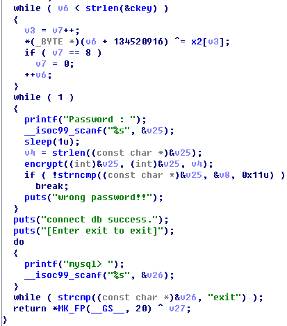

# CCE 2

sqlconnect라는 elf파일이 주어진다
이 파일은 암호 검사를 하며, 암호 검사를 통과한다면 sql데이터베이스에 접근할수 있다.
이때 올바른 암호가 이 문제의 flag이다.

우선 ida를 이용해 디컴파일 하였다.

분석해 보면 처음에 키를 숨기기 위한 난독화 코드가 있다.
그리고 `encrypt()`를 통하여 우리가 입력한 값을 암호화 한다.

`encrypt()`를 분석해 보자

`encrypt()`는 난독화한 키를 바탕으로, 우리가 넣은 패스워드를 `AES_ctr128_encrypt()`를 사용하여 암호화 한다.

그 후는 `strncmp()`를 이용하여 난독화한 패스워드와 비교를 하여 같다면, 통과시키고 그렇지 않다면 통과시키지 않는다.

그렇다면 `strncpm()`가 어떤 값과 비교하는지 알아볼 필요가 있을 것이다.
`ltrace`를 이용하여 알아보자

`&\375*\263\006\222\267t\307\351\004\020\337~\365\363\315&\376>\266`
이라는 값과 비교를 한다.(여기서`\`뒤에 있는 값은 아스키 값이 문자로 숫자로 표현현된 값이다)
`strncmp()`는 지정한 길이만큼(17)의 문자열만 비교하는데 길이가 21인 것은 무언가 이상하다.

그래서 다른 암호를 입력해 보았다.

값이 더 붙은 것을 볼 수 있다. 그리고 그 값은 AES를 통해 암호된 값과 같은 것을 발견할 수 있다.
따라서 우리가 넣은 패스워드가 AES암호화 된 값이
`/\375*\263\006\222\267t\307\351\004\020\337~\365\363\315`
과 같아야 함을 알 수 있다.

AES암호의 특징이라면 복호화를 할 때에, 암호화된 값을 동일한 키를 이용하여 암호화 한다면 원래의 평문이 나온다는 점이다.

이 점을 이용하여 gdb를 이용해 flag를 구해 보자.

우선 `strncmp()`에 브레이크 포인트(BP)를 걸고, 위의 값을 넣은후 진행을 시킨다면, BP에서 복화화된 값을 얻을 수 있을 것이다.
저 값을 넣기 위해`scanf()`에 BP를 걸고 값을 입력하였다.

입력 완료

BP를 벗어나서 `strncmp()`에서 플래그를 확인하자

플래그 hwaianchocolate를 확인
