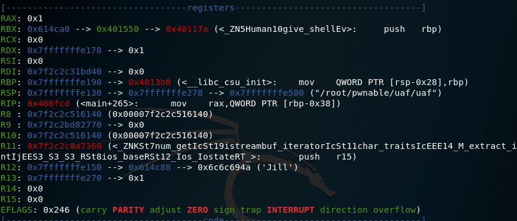
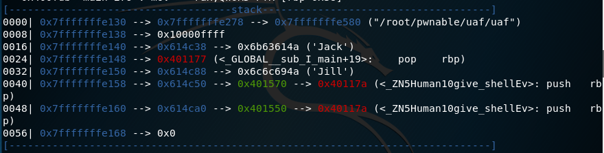
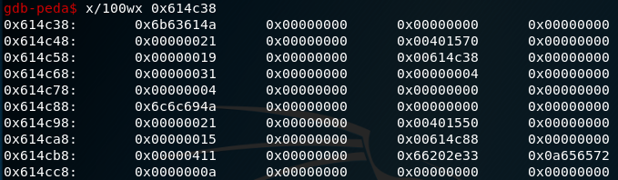
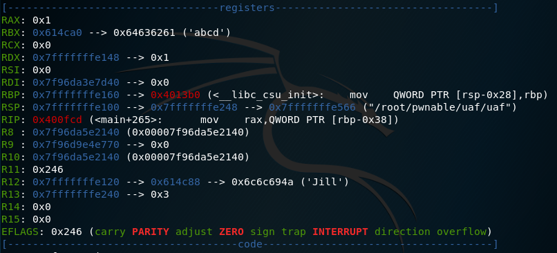
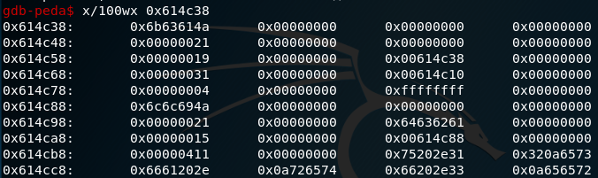
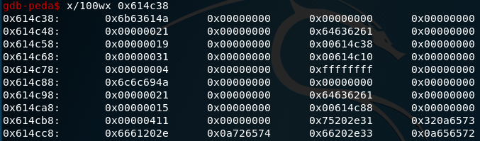
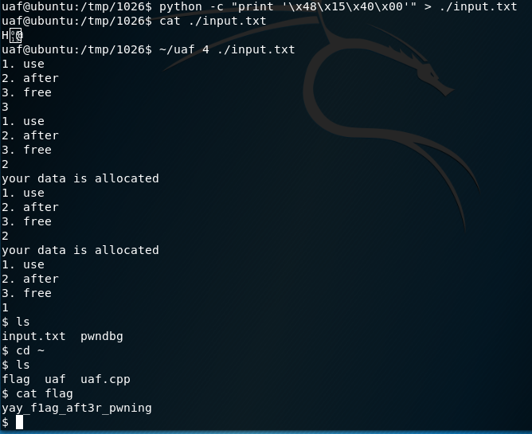

```
#include <fcntl.h>
#include <iostream>
#include <cstring>
#include <cstdlib>
#include <unistd.h>
using namespace std;

class Human{
private:
	virtual void give_shell(){
		system("/bin/sh");
	}
protected:
	int age;
	string name;
public:
	virtual void introduce(){
		cout << "My name is " << name << endl;
		cout << "I am " << age << " years old" << endl;
	}
};

class Man: public Human{
public:
	Man(string name, int age){
		this->name = name;
		this->age = age;
        }
        virtual void introduce(){
		Human::introduce();
                cout << "I am a nice guy!" << endl;
        }
};

class Woman: public Human{
public:
        Woman(string name, int age){
                this->name = name;
                this->age = age;
        }
        virtual void introduce(){
                Human::introduce();
                cout << "I am a cute girl!" << endl;
        }
};

int main(int argc, char* argv[]){
	Human* m = new Man("Jack", 25);
	Human* w = new Woman("Jill", 21);

	size_t len;
	char* data;
	unsigned int op;
	while(1){
		cout << "1. use\n2. after\n3. free\n";
		cin >> op;

		switch(op){
			case 1:
				m->introduce();
				w->introduce();
				break;
			case 2:
				len = atoi(argv[1]);
				data = new char[len];
				read(open(argv[2], O_RDONLY), data, len);
				cout << "your data is allocated" << endl;
				break;
			case 3:
				delete m;
				delete w;
				break;
			default:
				break;
		}
	}

	return 0;
}

```
UAF에 대해서 http://shayete.tistory.com/entry/7-Use-After-Free
http://kblab.tistory.com/255

```
0x0000000000400ec4 <+0>:	push   rbp
0x0000000000400ec5 <+1>:	mov    rbp,rsp
0x0000000000400ec8 <+4>:	push   r12
0x0000000000400eca <+6>:	push   rbx
0x0000000000400ecb <+7>:	sub    rsp,0x50
0x0000000000400ecf <+11>:	mov    DWORD PTR [rbp-0x54],edi
0x0000000000400ed2 <+14>:	mov    QWORD PTR [rbp-0x60],rsi
0x0000000000400ed6 <+18>:	lea    rax,[rbp-0x12]
0x0000000000400eda <+22>:	mov    rdi,rax
0x0000000000400edd <+25>:	call   0x400d70 <_ZNSaIcEC1Ev@plt>
0x0000000000400ee2 <+30>:	lea    rdx,[rbp-0x12]
0x0000000000400ee6 <+34>:	lea    rax,[rbp-0x50]
0x0000000000400eea <+38>:	mov    esi,0x4014f0
0x0000000000400eef <+43>:	mov    rdi,rax
0x0000000000400ef2 <+46>:	call   0x400d10 <_ZNSsC1EPKcRKSaIcE@plt>
0x0000000000400ef7 <+51>:	lea    r12,[rbp-0x50]
0x0000000000400efb <+55>:	mov    edi,0x18
0x0000000000400f00 <+60>:	call   0x400d90 <_Znwm@plt>
0x0000000000400f05 <+65>:	mov    rbx,rax
0x0000000000400f08 <+68>:	mov    edx,0x19
0x0000000000400f0d <+73>:	mov    rsi,r12
0x0000000000400f10 <+76>:	mov    rdi,rbx
---Type <return> to continue, or q <return> to quit---
0x0000000000400f13 <+79>:	call   0x401264 <_ZN3ManC2ESsi>
0x0000000000400f18 <+84>:	mov    QWORD PTR [rbp-0x38],rbx
0x0000000000400f1c <+88>:	lea    rax,[rbp-0x50]
0x0000000000400f20 <+92>:	mov    rdi,rax
0x0000000000400f23 <+95>:	call   0x400d00 <_ZNSsD1Ev@plt>
0x0000000000400f28 <+100>:	lea    rax,[rbp-0x12]
0x0000000000400f2c <+104>:	mov    rdi,rax
0x0000000000400f2f <+107>:	call   0x400d40 <_ZNSaIcED1Ev@plt>
0x0000000000400f34 <+112>:	lea    rax,[rbp-0x11]
0x0000000000400f38 <+116>:	mov    rdi,rax
0x0000000000400f3b <+119>:	call   0x400d70 <_ZNSaIcEC1Ev@plt>
0x0000000000400f40 <+124>:	lea    rdx,[rbp-0x11]
0x0000000000400f44 <+128>:	lea    rax,[rbp-0x40]
0x0000000000400f48 <+132>:	mov    esi,0x4014f5
0x0000000000400f4d <+137>:	mov    rdi,rax
0x0000000000400f50 <+140>:	call   0x400d10 <_ZNSsC1EPKcRKSaIcE@plt>
0x0000000000400f55 <+145>:	lea    r12,[rbp-0x40]
0x0000000000400f59 <+149>:	mov    edi,0x18
0x0000000000400f5e <+154>:	call   0x400d90 <_Znwm@plt>
0x0000000000400f63 <+159>:	mov    rbx,rax
0x0000000000400f66 <+162>:	mov    edx,0x15
0x0000000000400f6b <+167>:	mov    rsi,r12
0x0000000000400f6e <+170>:	mov    rdi,rbx
---Type <return> to continue, or q <return> to quit---
0x0000000000400f71 <+173>:	call   0x401308 <_ZN5WomanC2ESsi>
0x0000000000400f76 <+178>:	mov    QWORD PTR [rbp-0x30],rbx
0x0000000000400f7a <+182>:	lea    rax,[rbp-0x40]
0x0000000000400f7e <+186>:	mov    rdi,rax
0x0000000000400f81 <+189>:	call   0x400d00 <_ZNSsD1Ev@plt>
0x0000000000400f86 <+194>:	lea    rax,[rbp-0x11]
0x0000000000400f8a <+198>:	mov    rdi,rax
0x0000000000400f8d <+201>:	call   0x400d40 <_ZNSaIcED1Ev@plt>
0x0000000000400f92 <+206>:	mov    esi,0x4014fa
0x0000000000400f97 <+211>:	mov    edi,0x602260
0x0000000000400f9c <+216>:	call   0x400cf0 <_ZStlsISt11char_traitsIcEERSt13basic_ostreamIcT_ES5_PKc@plt>
0x0000000000400fa1 <+221>:	lea    rax,[rbp-0x18]
0x0000000000400fa5 <+225>:	mov    rsi,rax
0x0000000000400fa8 <+228>:	mov    edi,0x6020e0
0x0000000000400fad <+233>:	call   0x400dd0 <_ZNSirsERj@plt>
0x0000000000400fb2 <+238>:	mov    eax,DWORD PTR [rbp-0x18]
0x0000000000400fb5 <+241>:	cmp    eax,0x2
0x0000000000400fb8 <+244>:	je     0x401000 <main+316>
0x0000000000400fba <+246>:	cmp    eax,0x3
0x0000000000400fbd <+249>:	je     0x401076 <main+434>
0x0000000000400fc3 <+255>:	cmp    eax,0x1
0x0000000000400fc6 <+258>:	je     0x400fcd <main+265>
---Type <return> to continue, or q <return> to quit---
0x0000000000400fc8 <+260>:	jmp    0x4010a9 <main+485>
0x0000000000400fcd <+265>:	mov    rax,QWORD PTR [rbp-0x38]
0x0000000000400fd1 <+269>:	mov    rax,QWORD PTR [rax]
0x0000000000400fd4 <+272>:	add    rax,0x8
0x0000000000400fd8 <+276>:	mov    rdx,QWORD PTR [rax]
0x0000000000400fdb <+279>:	mov    rax,QWORD PTR [rbp-0x38]
0x0000000000400fdf <+283>:	mov    rdi,rax
0x0000000000400fe2 <+286>:	call   rdx
0x0000000000400fe4 <+288>:	mov    rax,QWORD PTR [rbp-0x30]
0x0000000000400fe8 <+292>:	mov    rax,QWORD PTR [rax]
0x0000000000400feb <+295>:	add    rax,0x8
0x0000000000400fef <+299>:	mov    rdx,QWORD PTR [rax]
0x0000000000400ff2 <+302>:	mov    rax,QWORD PTR [rbp-0x30]
0x0000000000400ff6 <+306>:	mov    rdi,rax
0x0000000000400ff9 <+309>:	call   rdx
0x0000000000400ffb <+311>:	jmp    0x4010a9 <main+485>
0x0000000000401000 <+316>:	mov    rax,QWORD PTR [rbp-0x60]
0x0000000000401004 <+320>:	add    rax,0x8
0x0000000000401008 <+324>:	mov    rax,QWORD PTR [rax]
0x000000000040100b <+327>:	mov    rdi,rax
0x000000000040100e <+330>:	call   0x400d20 <atoi@plt>
0x0000000000401013 <+335>:	cdqe   
0x0000000000401015 <+337>:	mov    QWORD PTR [rbp-0x28],rax
---Type <return> to continue, or q <return> to quit---
0x0000000000401019 <+341>:	mov    rax,QWORD PTR [rbp-0x28]
0x000000000040101d <+345>:	mov    rdi,rax
0x0000000000401020 <+348>:	call   0x400c70 <_Znam@plt>
0x0000000000401025 <+353>:	mov    QWORD PTR [rbp-0x20],rax
0x0000000000401029 <+357>:	mov    rax,QWORD PTR [rbp-0x60]
0x000000000040102d <+361>:	add    rax,0x10
0x0000000000401031 <+365>:	mov    rax,QWORD PTR [rax]
0x0000000000401034 <+368>:	mov    esi,0x0
0x0000000000401039 <+373>:	mov    rdi,rax
0x000000000040103c <+376>:	mov    eax,0x0
0x0000000000401041 <+381>:	call   0x400dc0 <open@plt>
0x0000000000401046 <+386>:	mov    rdx,QWORD PTR [rbp-0x28]
0x000000000040104a <+390>:	mov    rcx,QWORD PTR [rbp-0x20]
0x000000000040104e <+394>:	mov    rsi,rcx
0x0000000000401051 <+397>:	mov    edi,eax
0x0000000000401053 <+399>:	call   0x400ca0 <read@plt>
0x0000000000401058 <+404>:	mov    esi,0x401513
0x000000000040105d <+409>:	mov    edi,0x602260
0x0000000000401062 <+414>:	call   0x400cf0 <_ZStlsISt11char_traitsIcEERSt13basic_ostreamIcT_ES5_PKc@plt>
0x0000000000401067 <+419>:	mov    esi,0x400d60
0x000000000040106c <+424>:	mov    rdi,rax
0x000000000040106f <+427>:	call   0x400d50 <_ZNSolsEPFRSoS_E@plt>
---Type <return> to continue, or q <return> to quit---
0x0000000000401074 <+432>:	jmp    0x4010a9 <main+485>
0x0000000000401076 <+434>:	mov    rbx,QWORD PTR [rbp-0x38]
0x000000000040107a <+438>:	test   rbx,rbx
0x000000000040107d <+441>:	je     0x40108f <main+459>
0x000000000040107f <+443>:	mov    rdi,rbx
0x0000000000401082 <+446>:	call   0x40123a <_ZN5HumanD2Ev>
0x0000000000401087 <+451>:	mov    rdi,rbx
0x000000000040108a <+454>:	call   0x400c80 <_ZdlPv@plt>
0x000000000040108f <+459>:	mov    rbx,QWORD PTR [rbp-0x30]
0x0000000000401093 <+463>:	test   rbx,rbx
0x0000000000401096 <+466>:	je     0x4010a8 <main+484>
0x0000000000401098 <+468>:	mov    rdi,rbx
0x000000000040109b <+471>:	call   0x40123a <_ZN5HumanD2Ev>
0x00000000004010a0 <+476>:	mov    rdi,rbx
0x00000000004010a3 <+479>:	call   0x400c80 <_ZdlPv@plt>
0x00000000004010a8 <+484>:	nop
0x00000000004010a9 <+485>:	jmp    0x400f92 <main+206>
0x00000000004010ae <+490>:	mov    r12,rax
0x00000000004010b1 <+493>:	mov    rdi,rbx
0x00000000004010b4 <+496>:	call   0x400c80 <_ZdlPv@plt>
0x00000000004010b9 <+501>:	mov    rbx,r12
0x00000000004010bc <+504>:	jmp    0x4010c1 <main+509>
0x00000000004010be <+506>:	mov    rbx,rax
---Type <return> to continue, or q <return> to quit---
0x00000000004010c1 <+509>:	lea    rax,[rbp-0x50]
0x00000000004010c5 <+513>:	mov    rdi,rax
0x00000000004010c8 <+516>:	call   0x400d00 <_ZNSsD1Ev@plt>
0x00000000004010cd <+521>:	jmp    0x4010d2 <main+526>
0x00000000004010cf <+523>:	mov    rbx,rax
0x00000000004010d2 <+526>:	lea    rax,[rbp-0x12]
0x00000000004010d6 <+530>:	mov    rdi,rax
0x00000000004010d9 <+533>:	call   0x400d40 <_ZNSaIcED1Ev@plt>
0x00000000004010de <+538>:	mov    rax,rbx
0x00000000004010e1 <+541>:	mov    rdi,rax
0x00000000004010e4 <+544>:	call   0x400da0 <_Unwind_Resume@plt>
0x00000000004010e9 <+549>:	mov    r12,rax
0x00000000004010ec <+552>:	mov    rdi,rbx
0x00000000004010ef <+555>:	call   0x400c80 <_ZdlPv@plt>
0x00000000004010f4 <+560>:	mov    rbx,r12
0x00000000004010f7 <+563>:	jmp    0x4010fc <main+568>
0x00000000004010f9 <+565>:	mov    rbx,rax
0x00000000004010fc <+568>:	lea    rax,[rbp-0x40]
0x0000000000401100 <+572>:	mov    rdi,rax
0x0000000000401103 <+575>:	call   0x400d00 <_ZNSsD1Ev@plt>
0x0000000000401108 <+580>:	jmp    0x40110d <main+585>
0x000000000040110a <+582>:	mov    rbx,rax
0x000000000040110d <+585>:	lea    rax,[rbp-0x11]
---Type <return> to continue, or q <return> to quit---
0x0000000000401111 <+589>:	mov    rdi,rax
0x0000000000401114 <+592>:	call   0x400d40 <_ZNSaIcED1Ev@plt>
0x0000000000401119 <+597>:	mov    rax,rbx
0x000000000040111c <+600>:	mov    rdi,rax
0x000000000040111f <+603>:	call   0x400da0 <_Unwind_Resume@plt>
```


분기문
```
0x0000000000400fb5 <+241>:	cmp    eax,0x2
0x0000000000400fb8 <+244>:	je     0x401000 <main+316>
0x0000000000400fba <+246>:	cmp    eax,0x3
0x0000000000400fbd <+249>:	je     0x401076 <main+434>
0x0000000000400fc3 <+255>:	cmp    eax,0x1
0x0000000000400fc6 <+258>:	je     0x400fcd <main+265>
```

case1
호출 명령어 2개가 있고 끝내는 것을 보았을 때 case1이다.
```
0x0000000000400fcd <+265>:	mov    rax,QWORD PTR [rbp-0x38]
0x0000000000400fd1 <+269>:	mov    rax,QWORD PTR [rax]
0x0000000000400fd4 <+272>:	add    rax,0x8
0x0000000000400fd8 <+276>:	mov    rdx,QWORD PTR [rax]
0x0000000000400fdb <+279>:	mov    rax,QWORD PTR [rbp-0x38]
0x0000000000400fdf <+283>:	mov    rdi,rax
0x0000000000400fe2 <+286>:	call   rdx
0x0000000000400fe4 <+288>:	mov    rax,QWORD PTR [rbp-0x30]
0x0000000000400fe8 <+292>:	mov    rax,QWORD PTR [rax]
0x0000000000400feb <+295>:	add    rax,0x8
0x0000000000400fef <+299>:	mov    rdx,QWORD PTR [rax]
0x0000000000400ff2 <+302>:	mov    rax,QWORD PTR [rbp-0x30]
0x0000000000400ff6 <+306>:	mov    rdi,rax
0x0000000000400ff9 <+309>:	call   rdx
0x0000000000400ffb <+311>:	jmp    0x4010a9 <main+485>
```

case2
atoi를 통해 알 수 있다.
```
0x0000000000401000 <+316>:	mov    -0x60(%rbp),%rax
0x0000000000401004 <+320>:	add    $0x8,%rax
0x0000000000401008 <+324>:	mov    (%rax),%rax
0x000000000040100b <+327>:	mov    %rax,%rdi
0x000000000040100e <+330>:	callq  0x400d20 <atoi@plt>
0x0000000000401013 <+335>:	cltq   
0x0000000000401015 <+337>:	mov    %rax,-0x28(%rbp)
0x0000000000401019 <+341>:	mov    -0x28(%rbp),%rax
0x000000000040101d <+345>:	mov    %rax,%rdi
0x0000000000401020 <+348>:	callq  0x400c70 <_Znam@plt>
0x0000000000401025 <+353>:	mov    %rax,-0x20(%rbp)
0x0000000000401029 <+357>:	mov    -0x60(%rbp),%rax
0x000000000040102d <+361>:	add    $0x10,%rax
0x0000000000401031 <+365>:	mov    (%rax),%rax
0x0000000000401034 <+368>:	mov    $0x0,%esi
0x0000000000401039 <+373>:	mov    %rax,%rdi
0x000000000040103c <+376>:	mov    $0x0,%eax
0x0000000000401041 <+381>:	callq  0x400dc0 <open@plt>
0x0000000000401046 <+386>:	mov    -0x28(%rbp),%rdx
0x000000000040104a <+390>:	mov    -0x20(%rbp),%rcx
0x000000000040104e <+394>:	mov    %rcx,%rsi
0x0000000000401051 <+397>:	mov    %eax,%edi
0x0000000000401053 <+399>:	callq  0x400ca0 <read@plt>
0x0000000000401058 <+404>:	mov    $0x401513,%esi
0x000000000040105d <+409>:	mov    $0x602260,%edi
0x0000000000401062 <+414>:	callq  0x400cf0 <_ZStlsISt11char_traitsIcEERSt13basic_ostreamIcT_ES5_PKc@plt>
0x0000000000401067 <+419>:	mov    $0x400d60,%esi
0x000000000040106c <+424>:	mov    %rax,%rdi
0x000000000040106f <+427>:	callq  0x400d50 <_ZNSolsEPFRSoS_E@plt>
0x0000000000401074 <+432>:	jmp    0x4010a9 <main+485>
```

case3
```
0x0000000000401076 <+434>:	mov    -0x38(%rbp),%rbx
0x000000000040107a <+438>:	test   %rbx,%rbx
0x000000000040107d <+441>:	je     0x40108f <main+459>
0x000000000040107f <+443>:	mov    %rbx,%rdi
0x0000000000401082 <+446>:	callq  0x40123a <_ZN5HumanD2Ev>
0x0000000000401087 <+451>:	mov    %rbx,%rdi
0x000000000040108a <+454>:	callq  0x400c80 <_ZdlPv@plt>
0x000000000040108f <+459>:	mov    -0x30(%rbp),%rbx
0x0000000000401093 <+463>:	test   %rbx,%rbx
0x0000000000401096 <+466>:	je     0x4010a8 <main+484>
```


uaf 문제이다.
소스에서 함수를 실행시키는 부분은 cas1이므로 그 부분을 살펴보면 될 것이다.
gdb-peda를 이용하여 main+265에 브레이크 포인트를 걸고 스택, 메모리, 레지스터를 살펴 보았다.


RBX 를 통해 give_shellEV의 주소를 알 수 있다.



스택에서 Jack, Jill 스트링의 위치를 알 수 있다.


Jack스트링의 위치를 바탕으로 메모리를 확인하였다.

0x614c38 ~ 0x614c87 까지가 m 객체
0x614c88 ~ 0x614cd7 까지가 w 객체라고 유추할 수 있다.

그리고 각각의 객체에서 00401570, 00401550 값 즉, give_shell을 가리키는 값이 있다는 것을 확인할 수 있다.

또한 ni명령어를 이용하여 한 라인씩 실행한 결과.
introduce()함수는 give_shell()위치치에서 `0x400fd4 <main+272>:	add    rax,0x8`으로 구해진다는 것을 알 수 있다.

자 이제 case2를 통해 우리가 값을 할당하면 어떻게 되는지 확인해 보자
`r 4 input.txt`를 사용했다.
input.txt의 내용은 abcd 이다.

RBX에 내가 입력한 abcd가 들어간 것을 확인할 수 있다.

메모리의 상황
w객체에 내가 입력한 값이 덧씌워졌다.

할당을 두번 한 경우

w와 m객체에 값이 덧씌워진것을 확인할 수 있다.


자 이제 우리는 실행할 함수의 포인터를 마음대로 정할수 있게 되었다.
그리고 우리가 give_shell()을 실행하기 위해서는 0x00401570 -0x08 또는 0x00401550-0x08을 하면 될 것이다.


